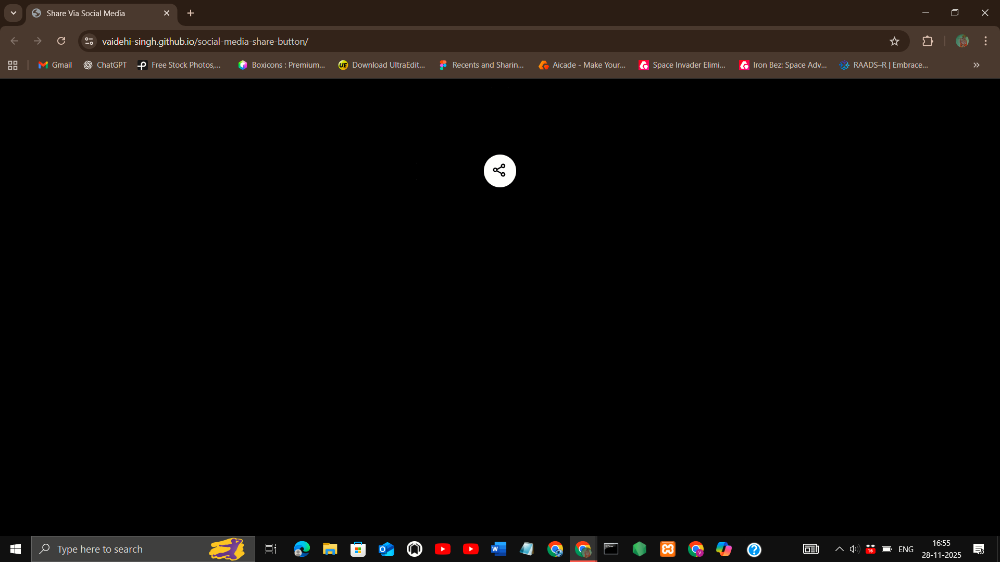
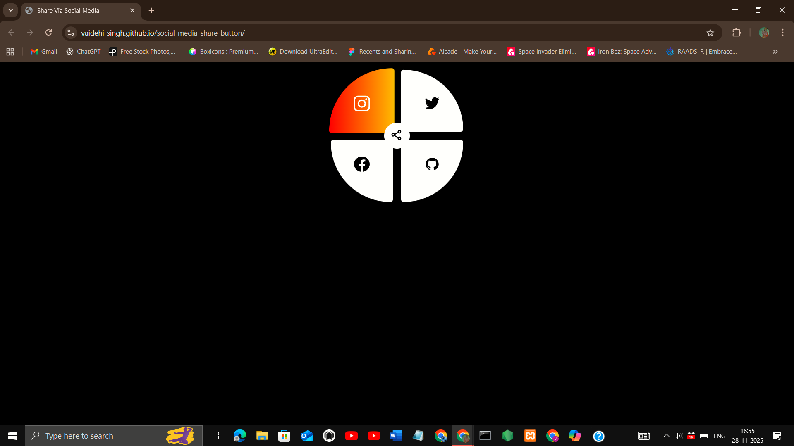

## Project Title
Social Media Share button

## Description
A modern social media share button with smooth hover effects and responsive design. Built using HTML, CSS, and JavaScript, it features customizable icons for platforms like Facebook, Twitter, Instagram, and GitHub, making content sharing stylish and simple.

## Features
- Responsive design (mobile, tablet, desktop)
- Smooth transitions and animations
- Clean, modern UI
- Interactive hover effects for social icons

## Demo
[Live Demo](https://vaidehi-singh.github.io/social-media-pop-name/)

## Screenshots




## Tech Stack
- HTML
- CSS
- JavaScript

## How to Use
 1. Clone the repo  
   ```bash
   git clone https://github.com/vaidehi-singh/social-media-share-button.git
   cd social-media-share-button
   ```
 2. Open index.html in your browser.

## Author
Designed and developed by **Vaidehi Singh**  
[GitHub Profile](https://github.com/vaidehi-singh)
